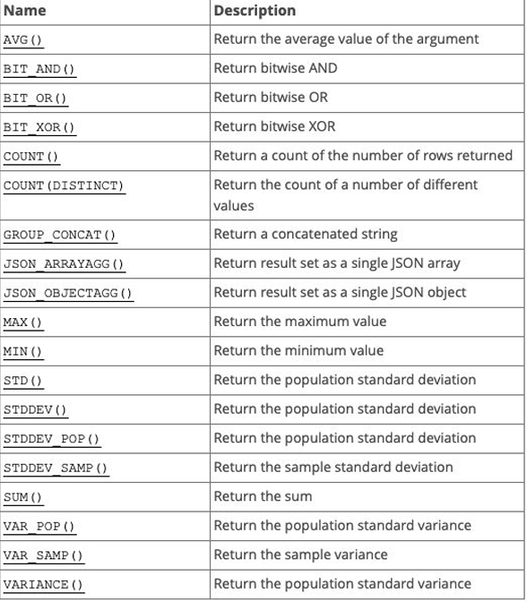

# 多表查询

## MySQL的聚合函数

**聚合函数**

**聚合函数表示对值的集合进行操作的组(集合)函数**

```sql
-- 查平局值 AVG
SELECT AVG(price) FROM products;

-- 最高 MAX 最低 MIN 求和 SUM 条数 COUNT
```



**Group By**

**事实上聚合函数相当于默认将所有的数据分成一组**

* 我们前面使用的avg还是max，都是将所有的结果堪称一组来计算的
* 那么如果我么希望划分多个组：比如华为，苹果，小米手机的分别的平均价格
* 这个时候就应该使用GROUP BY

**GROUP BY通常和聚合函数一起使用**

* 表示我么先对数据进行分组，在对每一组数据进行聚合函数的计算

```sql
/*
	根据品牌分组
	计算各个品牌中：商品的个数，平均价格，最高价，最低价格，平均评分
*/

-- 查询 brand字段
SELECT brand,
	-- 所有条数
	COUNT(*) as count,
	-- 平均值 四舍五入 保留两位小数
	ROUND(AVG(price), 2) as avgPrice,
	-- price最大值
	MAX(price) as maxPrice,
	-- price最小值
	MIN(price) as minPrice,
	-- score平均值
	AVG(score) as avgScore
FROM products GROUP BY brand;
```

**GROUP BY的约束条件**

* 如果我们希望给GROUP BY查询到的结果添加一些约束，那么我们可以使用：HAVING
* 比如：如果我们还希望筛选出平均价格在4000一下，并且平均分在7以上的品牌

```sql

SELECT brand,
	COUNT(*) as count,
	ROUND(AVG(price), 2) as avgPrice,
	MAX(price) as maxPrice,
	MIN(price) as minPrice,
	AVG(score) as avgScore
FROM `products` GROUP BY brand
HAVING avgPrice < 4000 and avgScore > 7;
```

## MySQL的外键约束

**创建多张表**

假如我们的上面的商品表中，对应的品牌还需要包含其他的信息

* 比如品牌的官网，品牌的世界排名，品牌的市值等等

如果我么直接在商品中体现品牌相关的信息，会存在一些问题

* 一方面，products表中应该表示商品相关的数据，应该有另一张表来表示brand的数据
* 另一方面，多个商品使用的品牌是一致的，会存在大量的冗余数据

所以我们可以将所有的品牌数据单独放在一张表中，创建一张品牌的表

```sql
CREATE TABLE IF NOT EXISTS `brand`(
	id INT PRIMARY KEY AUTO_INCREMENT,
    name VARCHAR(20) NOT NULL,
    website VARCHAR(100),
    worldRank INT
)
```

**创建外键**

将两张表联系起来，我们可以将products中的brand_id关联到brand中的id

* 如果是创建表添加外键约束，我们需要在创建表的()最后添加如下语句

```sql
FOREIGN KEY (brand_id) REFERNCES brand(id)
```

* 如果表时已经创建好的

```sql
ALTER TABLE `products` ADD `brand_id` INT;
ALTER TABLE `products` ADD FOREIGN KEY (brand_id) REFERNCES brand(id);
```

* 现在我们可以将products中的brand_id关联到brand中的id的值

```sql
UPDATE `products` SET `brand_id` = 1 WHERE `brand` = '华为'
```

**外键存在时更新和删除数据**

* 问题

  * 如果products中引用的外键被更新或者被删除了，这个时候，会出现什么情况

* 进行一个操作：如将华为的id更新为100

  * ```sql
    UPDATE `brand` SET id = 100 WHERE id = 1; 
    ```

* 这个时候会报错

## MySQL的多表查询

**如果我们希望查询到产品的同时，显示对应的品牌相关的信息，因为数据是存放在两张表中的，所以这个时候就需要进行多表查询**

**如果我么你直接通过查询语句希望在多张表中查询到数据**

```sql
SELECT * FROM `producets`, `brand`;
```

**默认多表查询的结果**

* 假设第一张表有10条数据，第二张表有5条数据，就会查出10*5条数据
* 也就是说第一张表中每一条数据，都会和第二张表中的数据结合一次
* 这个结果称为 笛卡尔乘积，也成为直积，表示X*Y

**但是事实上很多数据是没有意义的，比如华为和苹果、小米的品牌结合起来的数据就是没有意义的，我么你可不可以进行筛选呢**

* 使用where来进行筛选
* 这个表示查询到笛卡尔乘积后的结果中，符合products.brand_id = brand.id条件的数据过滤出来

```sql
SELECT * FROM `procudts`, `brand` WHERE `products`.brand_id = `brand`.id
```

## 表和表间的连接方式

## 多对多关系的关系表

## 多对多数据查询语句