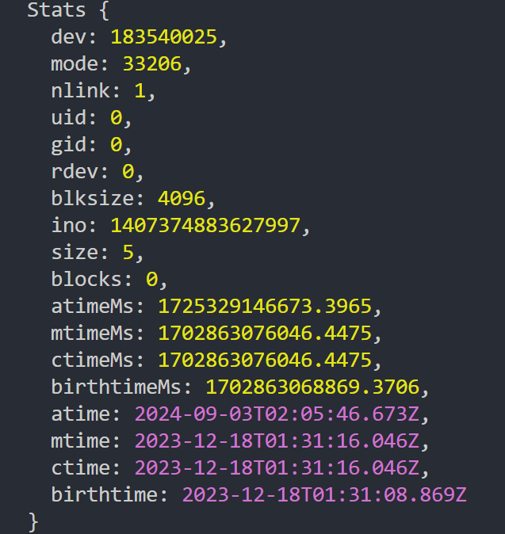

# fs模块

## 文件的读取

```javascript
// 1.同步方式读取 第二个参数是配置项 默认值buffer
const state = fs.readFileSync("文件路径", {
    encoding: "utf-8"
})

// 2.异步读取 第三个参数读取文件完成的回调
const file = fs.readFile("文件路径", {
    encoding: "utf-8"
}, (err, data) => {
    if(err) return
    console.log(data)
})

// 2.promisee方式
const = file = fs
	.promise
	.readFile("文件路径", {
        encoding: "utf-8"
    })
	.then(res => {
        console.log(res)
    })
	.catch(err => {
        console.log(err)
    })
```

## 文件描述符

```javascript
fs.open("文件路径", (err, fd) => {
    if(err) return
    
    // 读取文件描述符
    fs.fstat(fd, (err, stats) => {
        if(err) return
        console.log(stats)
    })
    
    // 手动关闭文件
    fs.close()
})
```



## 文件写入

**flag选项**

* w	打开文件写入	默认值
* w+ 打开文件进行读写(可读可写) 不存在就创建
* r    打开文件读取  读取时的默认值
* r+  打开文件进行读写  如果不存在那么抛出异常
* a   打开要写入的文件  将文件放在文件末尾  如果不存在就创建文件
* a+ 打开问文件以进行读写  (可读可写)  将流放在文件末尾  如果不存在则创建文件

```javascript
const content = 'hello world'

fs.writeFile("文件路径", content, {
    encoding: "utf-8",
    flag: "w"
}, (err) => {
    if(err) return
    console.lg("写入")
})
```

## 文件创建

```javascript
fs.mkdir("文件路径", (err) => {
    if(err) return
    console.log("创建成功")
})
```

## 读取文件夹

```javascript
fs.readdir("文件路径", { withFileTypes: true }, (err, files) => {
    if(err) return
    files.forEach(file => {
        if(file.isDirectory()) {
            console.log(`${file.name}是文件夹`)
        }else {
            console.log(`${file.name}是文件`)
        }
    })
})

// 递归读取所有文件名
const readDirs = (path) => {
    fs.readdir(path, { withFileTypes： true }, (err, files) => {
        if(files.isDirectory()) {
            readDirs(`${path}/${files.name}`)
        }else {
            console.log(`${item.name}`)
        }
    })
}
```

## 文件夹重命名

```javascript
fs.rename("文件路径", "新名称", (err) => {
    if(err) return
    console.log("修改成功")
})
```

