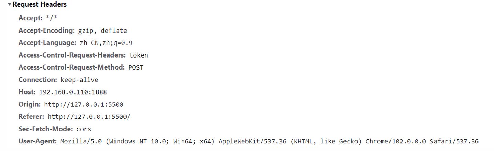

# Http模块

## Web服务器

**什么是web服务器**

* 当应用程序需要某一个资源时，可以向一台服务器，通过http请求获取到这个资源
* 提供资源的这个服务器，就是一个web服务器

## htpp模块

在node提供，提供web服务器的资源返回给浏览器，主要是通过http模块

```javascript
const http = require("http")

const server = http.createServer((req, res) => {
    res.end("hello world")
})

server.listen(3000, () => {
    console.log("服务启动")
})
```

## 创建服务器

**创建服务器对象，我们是使用createServer来完成的**

* http.createServer会返回服务器的对象
* 底层其实使用直接new Server对象

```javascript
function createServer(opts, requestListener) {
    return new Server(opts, requestListener)
}
```

**我们也可以直接使用这个创建对象**

```javascript
const { Server } = require("http")

const server = new Server((req, res) => {
    res.end("hello")
})

server.listen(3000, () => {
    console.log("服务启动成功")
})
```

## 监听主机和端口号

**Server通过listen方法来开启服务器，并且在某一个主机和端口上监听网络请求**

* 也就是当我们通过ip:port的方式发送到我们监听的web服务器上时
* 我们就可以对器进行相关的处理

**listen有三个参数**

* port：可以不传，系统会默认分配
* host：通常可以传如localhost、ip地址127.0.0.1，或者ip地址0.0.0.0，默认是0.0.0.0
  * localhost	本质上是一个域名	通常情况下会被解析成127.0.0.1
  * 127.0.0.1    回环地址，表达的意思其实就是我们主机自己发出去的包，会被自己接收
  * 0.0.0.0    监听ipv4上的网络，在根据端口找到不同的应用程序，比如我们监听0.0.0.0时，在同一个网段下的主机中，通过ip地址是可以访问的
* 回调函数
  * 服务器启动的时候执行

## request对象

**请求体**

在向服务器请求时，会携带很多信息

* 本次请求的url，服务器需要根据不同的url进行不同的处理
* 本次请求的请求方式，比如get，post请求传入的参数和处理处理的方式是不同的
* 本次请求的headers中也会携带一些信息，比如客户端信息，接收数据的格式，支持的编码格式
* 等等

这些信息node会帮我们封装到request对象中，我们可以直接来处理这个对象

```javascript
const server = new Server((req, res) => {
    console.log(req.url)
    console.log(req.method)
    console.log(req.headers)
    
    res.end("hello")
})
```

## URL的处理

**客户端在发送请求时，会请求不同的数据，那么会传入不同的请求地址**

* 比如 http://localhost:8000/login
* 比如http://localhost:8000/products

**服务器需要根据不同的请求地址，做出不同的相应**

```javascript
const server = new Server((req, res) => {
    const url = req.url
    if(url === '/login') {
        res.end("hello")
    }else if(url === "/products") {
        res.end("products")
    }else {
        res.end("err")
    }
})
```

## URL的解析

**那么用户的请求还携带参数**

* http://localhost:8000/login?name=why&password=123

**如何解析，使用内置模块url**

```javascript
const parseInfo = url.parse(req.url)
console.log(parseInfo)
```

**query信息如何获取**

```javascript
const qs = require('querystring')

const { pathname, query } = url.parse(req.url)

const queryObj = qs.parse(query)
console.log(queryObj.name)
console.log(queryObj.password)
```

## method的处理

**在Restful规范（设计风格）中，我们对于数据的增删改查应该通过不同的请求方式**

* get 查询数据
* post 新建数据
* patch 更新数据
* delete 删除数据

## HTTP Rquest Header

**在request对象的header中也包含很多信息**



**content-type是这次请求携带的数据的类型**

* application/x-www-form-urlencoded: 表示数据被编码成以&分割的键值对，同时以=分割键值
* application/json: 表示是一个json类型
* text/plain:表示是文本类型
* application/xml:表示是xml类型
* multipart/form-data: 表示是上传文件

**content-length**

* 文件大小长度

**keep-alive**

* http是基于tcp协议的，但是通常在进行一次请求和相应结束后会立刻中断
* 在http1.0中，如果想要继续保持连接
  * 浏览器需要在请求头上添加connection:keep-alive
  * 服务器需要在响应头中添加connection:keep-alive
  * 当客户端在次访问请求时，就会使用同一个连接，直接一方中断链接
* 在http1.1中，所有连接默认是connection:keep-alive的
  * 不同的web服务器会有不容保持keep-alive的时间
  * node中默认时5s中

**accept-encoding**

* 告知服务器，客户端支持的文件压缩格式，比如js文件可以使用gzip编码，对应.gz文件

**accept**

* 告知服务器，客户端可以接受文件的格式类型

**user-agent**

* 客户端相关的信息

## 返回响应结果

**如果我们希望给客户端相应结果数据可以使用两种方式**

* write：这种方式是直接写出数据，但是并没有关闭数据流
* end：这种方式是写出最后的数据，并且写出后会关闭流

```javascript
```


