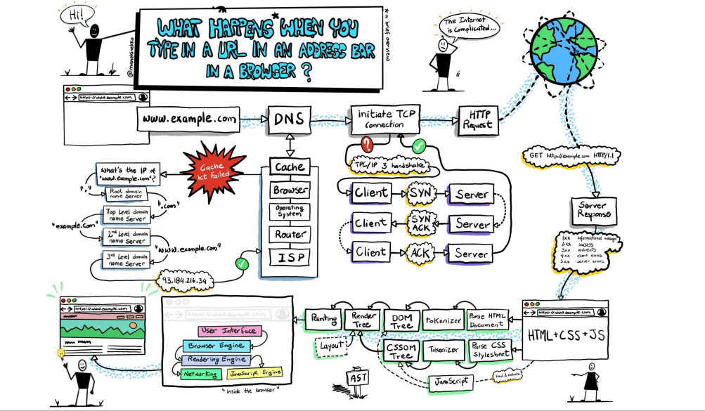

# DNS、TCP解析

## 浏览器输入一个URL并enter时，到底发生了什么

## **DNS 服务器解析过程**

**当我们在浏览器中输入一个URL的时候，我们需要先找到他对应的IP地址：这个过程被称为DNS解析，即域名系统解析**

**缓存查找过程**

* 浏览器缓存：首先，浏览器会检查缓存时候有这个域名的记录，因为之前访问的网址的解析结果可能被存储在浏览器缓存中
* 操作系统缓存：如果浏览器缓存中没有找到，浏览器会询问操作系统，因为操作系统也可能有自己的DNS缓存
* 路由器缓存：如果操作系统中没有找到，请求会发送到本地的路由器，他同样可能有自己的DNS缓存
* ISP缓存：如果以上缓存记录都没有，请求最终会发到互联网供应商 ISP，他们通常会有更大范围的DNS缓存

**DNS递归解析** 如果所有本地缓存查找都失败，DNS查询就变成一个递归查询过程，涉及到多个DNS服务器

* 根域名服务器：首先，你的DNS查询会被发送到根域名服务器。根服务器是最高级别的DNS服务器，负责重定向到负责管理顶级域名(如.com，.net)的顶级域名服务器
* 顶级域名服务器(TLD服务器)：根服务器会告诉你的ISP的DNS服务器去查询那个顶级域名来找到.com域的信息。这个服务器掌控所有.com域名及其对应服务器的信息
* 权威域名服务器：一旦你的DNS查询到达了正确的顶级域名服务器，他会进一步定向到负责example.com的权威服务器。权威服务器有该域名所对应的具体IP地址

## IP地址获取和缓存

**IP地址的获取**

* 最终，权威域名服务器会提供域名对应的IP地址，这个信息会被发送到用户的电脑

**缓存结果**

* 一旦IP地址被找到，它通常会被存储在浏览器、操作系统、路由器或ISP的DNS缓存中，以便未来的查询可以更快得到解析

## 建立TCP连接

**TCP是一种面向连接的协议，用于在网路中的两个端点之间建立可靠的会话**

**TCP建立过程需要三次握手**

**SYN**

* 客户端发送一个SYN包到服务器以初始化一个连接
* 客户端设置一个随机的序列号，告诉服务器它准备开始发送数据
* 序列号不仅仅实在握手期间使用的，后续传输数据也会用到，用来保证数据的完整性和顺序

**SYN-ACK**

* 服务器接受到客户端的SYN包后，会发送一个SYN-ACK包作为相应
* 服务器同样设置一个随机的序列号，并将客户端的序列号加一，发送给客户端，确认已经收到客户端的同步请求(+1表示服务器确认收到)

**ACK**

* 客户端收到服务器的SYN-ACK后，发送一个ACK包作为回应
* 这个ACK包将服务器的序号加一，并可能包含客户端准备发送的数据的开始部分(比如HTTP请求行 GET/HTTP/1.1 和请求头 这个被称为TCP快速打开)
* 此时，TCP连接已经建立，双方可以开始数据传输

## 发送HTTP请求

**HTTP**

* 他是建立在TCP连接之上的应用曾协议

**HTTP工作流程**

**客户端请求**

* 一旦TCP连接建立，客户端(通常是web浏览器)就可以通过这个连接发送一个HTTP请求到服务器
* 这个请求包含了方法(GET POST等)，URL和协议版本，以及可能包含的请求头和请求体

**服务器响应**

* 服务器接收到HTTP请求后，会处理这个请求并返回HTTP相应
* 相应通常包括一个状态码(如200表示成功， 404表示未找到)，响应头、以及任何相应内容

**TCP为HTTP提供了一个可靠的通道，确保数据正确、完整的冲服务器传输到客户端**

## 总结

**在用户在浏览器中输入一个URL，并且按下enter键时**

1. DNS解析
   1. 用户输入的URL通常会是一个域名地址，直接通过域名是无法找到服务器的，因为服务器本质上是一套拥有IP地址的主机
   2. 我们需要通过DNS服务器来解析域名，并且获取IP地址
   3. DNS会查找缓存，缓存的查找包括浏览器缓存、操作系统缓存、路由器缓存、ISP缓存，如果在缓存中找到就可以使用对应的IP地址去连接主机
   4. 如果缓存查找失败，我们需要通过DNS递归解析，解析过程包括根域名服务器、顶级域名服务器、权威域名服务器
   5. 最终找到IP地址，就可以通过该IP地址去连接服务器，并且IP地址信息会被发送回用户的电脑，缓存起来
2. TCP连接
   1. 虽然我们是发送的HTTP请求，但是HTTP协议是应用层协议，它是建立在TCP传输层协议之上的，所以我们需要先进行TCP连接
   2. TCP的连接会经常三次握手，客户端发送SYN包，服务器接收到后返回一个SYN-ACK包，客户端再次发送一个ACK包，完成握手过程
   3. 此时TCP连接建立完成，双方就可以开始传输数据了
3. HTTP请求
   1. 一旦TCP建立连接成功，客户端就可以通过这个链接发送HTTP请求，包括请求方法、URI、协议版本、请求头、请求体
   2. 服务器收到HTTP请求后，会处理这个请求，并且返回一个HTTP响应
   3. HTTP响应包括状态码、响应头、响应内容，我们这里请求的通常是index.html文件
4. HTML解析和CSS解析
   1. 浏览器在获取到index.html后可以开始对文档进行解析
   2. 包括HTML解析来构建DOM Tree，在这个过程中它会遇到CSS文件和JS文件
   3. 遇到CSS和JS文件会继续向服务器发送HTTP请求，并且下载CSS、JS文件
   4. 之后对CSS文件进行解析，解析出对应的CSSOM（CSS Object Model）
5. 渲染render、布局layout、绘制paint
   1. DOM Tree和CSSOM可以共同来构建Render Tree
   2. 之后会在Render Tree上运行布局layout计算每个阶段的几何体
   3. 再由浏览器将每个阶段绘制paint到屏幕上的像素点
6. composite合成
   1. 这里还有一个优化的手段是将元素绘制到多个合成图层中
   2. 默认情况下，标准流中的内容是被绘制到同一个图层（Layer）中的
   3. 我们可以通过一些特定的方法来创建新的合成层（CompositingLayer），新的图层可以利用GPU来加速绘制
   4. 比如我们通过3D Transforms/video/canvas/ifram/positionfixed/will-change等
   5. 但是分层确实可以提供性能，但是它是以内存管理为代价的

