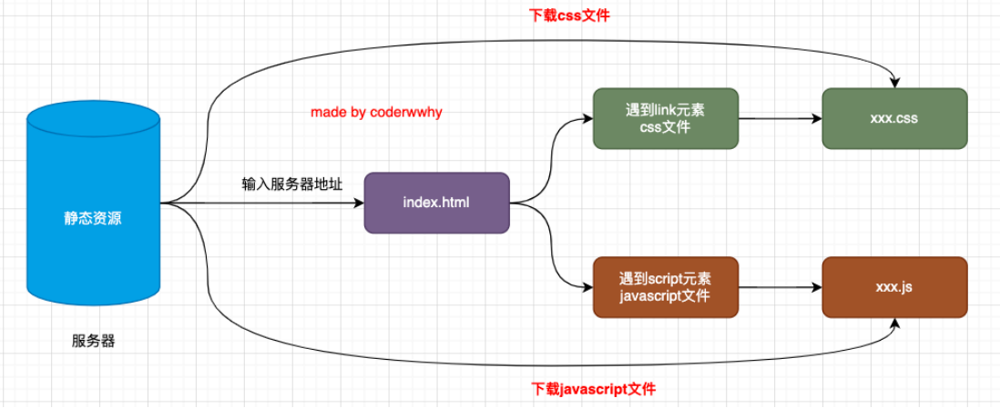
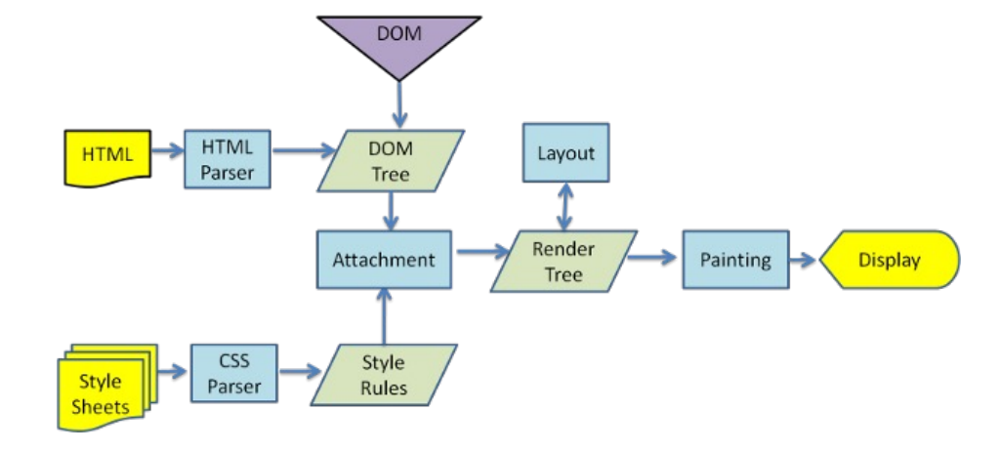
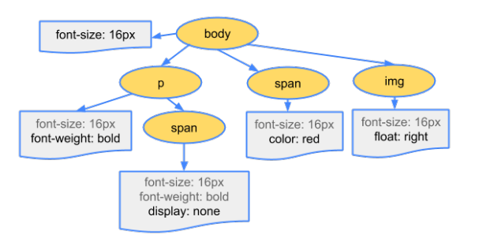

## 网页被解析的过程

**服务器下载资源的过程**



## 渲染页面的详细流程



## 解析一：HTML解析过程

**因为默认情况下，服务器会给浏览器返回index.html文件，所以解析HTML是所有步骤的开始**

**解析HTML，会创建DOM Tree**

```html
<!DOCTYPE html>
<html lang="en">
<head>
  <meta charset="UTF-8">
  <meta name="viewport" content="width=device-width, initial-scale=1.0">
  <title>Document</title>
</head>
<body>
    <p>hello <span>world</span> hi</p>
    <div>
      
    </div>
</body>
</html>
```


## 解析二：生成CSS规则

**在解析的过程中，如果遇到CSS的link元素，那么会由浏览器负责下载对应的css文件**

* 下载CSS文件是不会影响DOM的解析的

浏览器下载完CSS文件后，就会对CSS文件进行解析，解析出对应的规则树

* 我们可以称为CSSOM

```css
body {
    font-size: 16px
}
p {
    font-weight: bold
}
p span {
    display: none
}
img {
    float: right
}
```



## 解析三：构建Render Tree

**当有了DOM Tree 和 CSSOM Tree 就可以两个结合来构建Render Tree**

**注意：link元素不会阻塞DOM Tree的构建过程，但是会阻塞Render Tree的构建过程**

* 这个因为Render Tree在构建时，需要对应的CSSOM Tree

**注意：Render Tree和DOM Tree并不是一一对应的关系，比如display为none的元素，压根不会出现在render tree中**

## **解析四：布局(layout)和绘制(paint)**

**第四步是在渲染树上运行布局以计算每个节点的几何体**

* 渲染树会表示那些节点以及其他样式，但是不表示每个节点的尺寸、位置等信息
* 布局是确定呈现树中所有间的的宽高和位置信息

**第五步是将每个节点绘制到屏幕上**

* 在绘制阶段，浏览器将布局阶段计算的每个frame转成屏幕上实际的像素点
* 包括将元素的可见部分进行绘制，比如文本、颜色、边框、阴影、替换元素(如img)

Match selectors：浏览器遍历CSSOM，将选择器与DOM树中的元素匹配。这个过程决定了哪些CSS规则应用于哪些DOM元素

Compute style：在选择器匹配后，浏览器计算每个元素的最终样式。这包括计算具体的样式值，处理继承的样式以及解析因层叠产生的任何冲突

Construct frames：这通常是指生成布局树，它是渲染树的一部分，仅包含要布局和绘制的元素。这一步骤涉及确定文档的结构层次和包含块。 p 布局树和渲染树是有微小的差异，布局树是渲染树的子集，不包含渲染树中元素的颜色、背景、阴影等信息