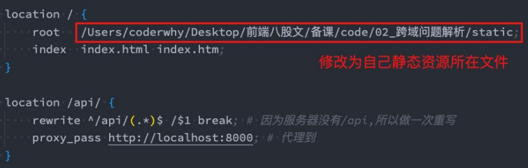
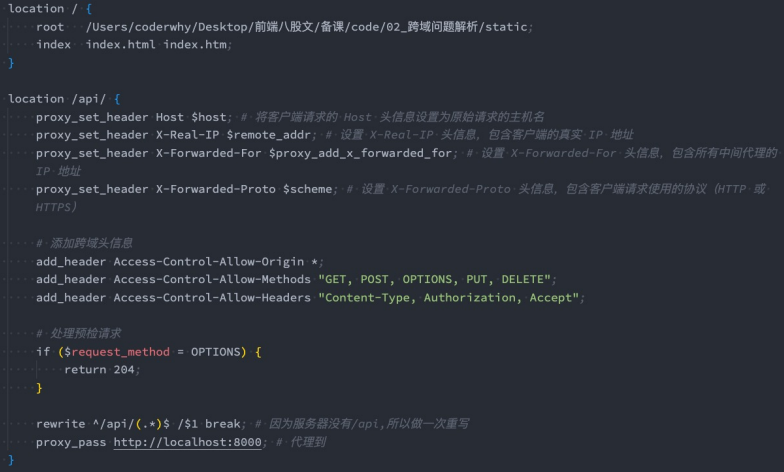

## Nginx反向代理配置

**我们在Nginx中实现跨域访问，可以分成两种情况**

* 情况一：Nginx代理了静态资源和API服务器
* 情况二：Nginx仅仅代理API服务器

**情况一 在这种情况下，Nginx即代理前端静态资源，又代理API请求**

* 因为静态资源和API请求都是在同一个服务器中，所以其实可以不需要设置跨域访问

**情况二 Nginx仅仅代理API服务器**

* 这种情况下，前端静态资源由前端服务器直接提供，Nginx仅用于代理API请求

## 遇到跨域问题，并解释产生原因

**在开发过程中，我们几乎都会遇到跨域请求问题，这主要是因为浏览器的同源策略**

* 同源策略要求执行脚本的网页的源必须与请求的资源的源相同，否则浏览器会阻止这种请求
* 具体来说，同源策略要求协议、端口（如果有指定），和域名完全匹配

**简单例子**

* 举个例子，如果我们开发过程中，前端项目是部署在http://localhost:3000（本地开启的服务）
* 而后端API部署在http://api.example.com，由于域名不同，直接从前端向后端发起请求，就会因为不符合同源策略而被浏览器拦截

**在开发过程中我们的解决方案主要有如下几种**

* CORS 设置
* 在Vite或Webpack中配置
* 当然，还有生成环境，我们可以到时候回答Nginx