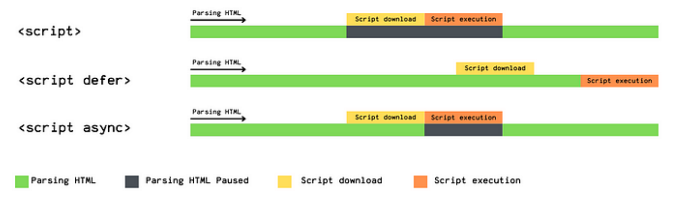

## defer和async属性在script标签上的作用

浏览器在解析HTML的过程中，遇到了script元素是不能继续构建DOM树的

* 他会停止继续构建，首先下载js代码，并执行(阻塞DOM Tree的构建)
* 只有等到js执行结束之后，才会继续解析HTML，构建DOM树

为什么要这样处理

* 因为js的作用之一就是操作DOM，修改DOM
* 如果等到DOM树构建完成并且渲染在执行js，会造成严重的回流和重绘，影响页面的性能
* 所以在遇到script元素的时候，会优先下载执行js，之后在构建DOM树

但是这样也会带来新的问题

* 在vue、react开发中，js代码会比HTML更重，下载的时间需要更长
* 造成页面的阻塞，在脚本下载，执行之后，浪费很多时间和性能

**为了解决这个问题，script元素提供了连个属性 defer 和 async**

defer属性告诉浏览器不要等待脚本执行，而继续解析DOM Tree

* 脚本会有浏览器来进行下载，但是不会阻塞DOM Tree的构建过程
* 如果脚本提前下载好了，他会等待DOM Tree构建完成，在DOMContentLoaded事件之前执行defer的代码

```javascript
<script defer src="./js/defer.js"></script>

<script>
window.addEventListener("DOMContentLoader", () => {
	console.log("DOMContentLoader")    
})    
</script>
```

* 另外多个带defer的脚本是可以保持正确的顺序执行的
* 所以defer可以提高页面的性能，并且推荐放到head元素中

**async特性与defer有些类似，他也能够让脚本不阻塞页面**

**async是一个让脚本的下载和执行是独立的**

* 浏览器不会因为async脚本的下载而阻塞(与defer类似)
* async脚本会在下载好之后立即执行，不能保证在DOMContentLoader之前或者之后执行(执行时会阻塞DOM Tree的构建)
* async脚本不能保证顺序，他是独立下载，独立运行的，不会等待其他脚本



**使用场景**

* defer通常用于需要在文档解析后操作DOM的js代码，并且对于多个script文件有顺序要求
* async通常用于独立的脚本，对于其他的脚本，甚至对于DOM没有以来的脚本

**在现代的框架开发中，并不需要我们来配置async或defer**

* 在使用脚手架或者自己搭建的webpack或者vite项目进行打包的时候，它会根据需要帮助我们加上defer属性
* 某些情况我们想要进行性能优化的时候，也可以手动机上async属性(例如一些第三方的分析工具或者广告追踪脚本)