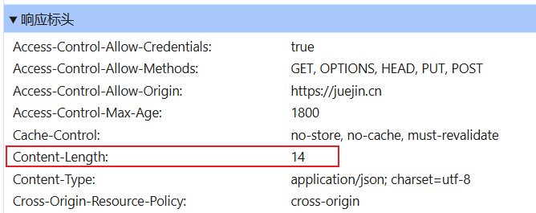

## fetch与xhr区别

1. 默认只支持get,post
2. 默认不携带cookie
3. 第一个then返回的数据格式
   1. text
   2. json
   3. arrayBuffer
   4. formData

node 18以后 也可以直接使用fetch

## 创建一个fetch请求

```javascript
// 接收一个字符 默认get请求
fetch("http://localhost:3000/get")
```

## 判断请求是否成功

```javascript
/*
fetch() 发出请求后 有一个很重要的点 只有网络错误 或者无法连接时 fetch() 才会报错
其他情况都不会报错 而是认为成功
这就是说 即使服务器返回的状态码是4xx或5xx fetch 也不获报错 即Promise的状态变为rejected
只用通过response.status这个属性才能判断是否成功
*/

const res = await fetch("http://localhost:3000/get")

if( res.status >= 200 && res.status < 300 ) {
    console.log("成功")
}else {
	throw new Error("失败")
}
```

## 进度条

```javascript
/*
xhr提供了进度条的事件 我们可以通过事件对象参数来获取到全部和当前
fetch没有提供这样的事件 该如何来处理进度条

Content-Length
是一个实体消息首部，用来指明发送给接收方的消息主体的大小，即用十进制数字表示的八位元组的数目。
*/

fetch("http://localhost:3000/get").then(async (res) => {
    // 获取文件全部长度
    const contentLength = res.headers.get("content-length");
    // 响应体的流
    const reader = res.body?.getReader();
    
    // 准备计数
   	let current = 0
     
    while (true) {
        const { done, value } = await reader.read()
        
        // 是否结束
        if(done) break
        current += value.length || 0
        
        // 在这里就可以计算进度条
        // current 当前值
        // contentLength 总值
        
    }
    
})


```



## 注意

```javascript
/*
fetch第一个then返回的是流
我们需要在第二个then才能拿到数据
这个流也只能使用一次
*/

fetch("http://localhost:3000/get").then(res => {
    // 如果需要使用流 需要先克隆一份 用来返回 保证之后可以接收
    const resClone = res.clone();
    
    // 对流进行使用
    const contentLength = res.headers.get("content-length");
    
    /*
    	不同的流需要不同的处理
    	text res.text()
    	json res.json()
    	等等
    */
    
    // 在使用这种方式会报错
    // return res.text()
    
    return resClone.text()
}).then(res => {
    console.log(res)
})

```

## 取消

```javascript
/*
	fetch也没有体统取消请求的方法
	我们需要借助 AbortController
	AbortController 接口表示一个控制器对象，允许你根据需要中止一个或多个 Web 请求。
	它提供了一个about方法用来中止一个尚未完成的异步操作
	也提供了一个属性signal 返回一个 AbortSignal 对象实例，可以用它来和异步操作进行通信或者中止这个操作。
	
*/

const about = new AbortController();

// 使用第二个配置项参数
fetch("http://localhost:3000/get", {
    signal: about.signal
})

// 取消请求
about.abort();
```

