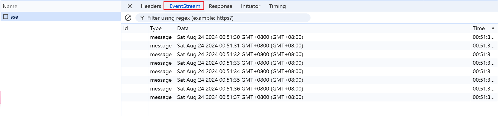

## SSE

Server-Sent Events简称 SSE。

服务器向客户端声明，接下来要发送的是流信息（streaming）。

也就是说，发送的不是一次性的数据包，而是一个数据流，会连续不断地发送过来。这时，客户端不会关闭连接，会一直等着服务器发过来的新的数据流。本质上，这种通信就是以流信息的方式，完成一次用时很长的下载。

SSE 就是利用这种机制，使用流信息向浏览器推送信息。

SSE 与 WebSocket 作用相似，都是建立浏览器与服务器之间的通信渠道，然后服务器向浏览器推送信息。

总体来说，WebSocket 更强大和灵活。因为它是全双工通道，可以双向通信；SSE 是单向通道，只能服务器向浏览器发送，因为流信息本质上就是下载。如果浏览器向服务器发送信息，就变成了另一次 HTTP 请求。

## 实现

**前端**

```javascript
const source = new EventSource("http://localhost:3000/sse");

source.addEventListener("open", () => {
    console.log("开启")
})

source.addEventListener("message", e => {
    console.log(e)
})

source.addEventListener("error", e => {
    console.log(e, "错误")
})
```

**后端**

```javascript
res.writeHead(200, {
    'Content-Type': 'text/event-stream', // 核心就是这个 必须设置为这样
    'Connection': 'keep-alive', // 断开会自动重连
})

// 每一秒返回一次数据
setInterval(() => {
    // 默认前端接受事件为 message
    // 我们也可以 自定义事件名 因为可能会有多个sse链接
    // res.write('event:test\n')
    
    // 返回数据格式必须为 data: xxx \n\n
    res.write('data:' + new Date() + '\n\n')
}, 1000)
```

## 效果



我们接口这里就可以看到服务器一直向客户端推送数据。